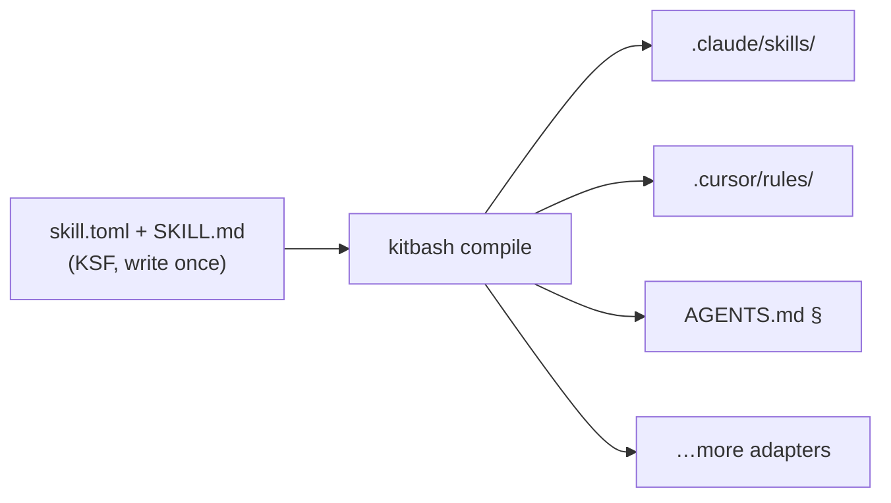

<p align="center">
  
</p>

# Kitbash

<p align="center">
  <a href="https://github.com/singhharsh1708/kitbash/stargazers"></a>
  <a href="https://www.npmjs.com/package/kitbash"></a>
  <a href="https://www.npmjs.com/package/kitbash"></a>
  <a href="https://github.com/singhharsh1708/kitbash/actions/workflows/ci.yml"></a>
  
  <a href="LICENSE"></a>
</p>

Kitbash is an open format for AI agent skills, plus a compiler that turns one skill into whatever your agent actually reads. You write the skill once and run it in Claude Code, Cursor, Copilot, and the rest, instead of maintaining a separate copy for each one.

If you've used npm for packages, Docker for containers, or ESLint for lint rules, it's the same idea for agent skills.

**Stable specification, experimental ecosystem.** The KSF core is stabilized through [RFC 0002](rfcs/0002-ksf-1.0-stabilization.md): the manifest fields are frozen and evolve additive-only within the major version, so you can author skills and write adapters against a contract that won't shift under you. The ecosystem around it — more adapters, the index, first-party skills — is still early.

> **Compiler insight** — Kitbash measures a skill's *standing token cost* (what it adds to your context every session) at compile time, before you ever install it. On a lazy target that's ~40 tokens; compiled to an eager one it's ~490 — a [12× per-session tax](docs/benchmarks/README.md) no other format surfaces. Run `npm run bench` for the numbers.

## A quick look

<p align="center">
  
</p>

That's an actual session. A third-party skill from the [skills.sh](https://www.skills.sh) convention gets installed and compiled into three agent formats. The thing to notice is the last warning: during compile, Kitbash measured the skill and pointed out that it quietly costs about 5,044 tokens on every request for agents that can't lazy-load. A converter would just translate the format. The compiler reads it and tells you what it's going to cost you. I haven't found another tool that surfaces that number.

That gap is measured, not asserted — see the [benchmark](docs/benchmarks/README.md): the same skill costs ~40 standing tokens on a lazy target and ~490 on an eager one, a 12× per-session tax that a team running four agents pays four times over. Reproduce it with `npm run bench`.

Install it (npm or Homebrew — see [Installation](#installation)), then in a repo:

```bash
kitbash init
kitbash install gh:singhharsh1708/kitbash/examples/skills/prereview
kitbash compile
```

What's working right now: `init`, `install` (via `gh:`, `owner/repo`, or `file:`), and `compile` to eight targets — Claude Code, Cursor, Copilot, Cline, Windsurf, GEMINI.md, Aider's CONVENTIONS.md, and the AGENTS.md floor. Declared `/commands` compile down to native slash commands. You also get `doctor`, `list`, `remove`, budget enforcement, a content-hash lockfile with drift detection, stale-output pruning, and `--strict`. Evals, update diffs, and everything else are on the [roadmap](docs/roadmap.md).

Already have skills? A plain SKILL.md folder — the [skills.sh](https://www.skills.sh) / Claude Skills convention — installs directly with `kitbash install owner/repo`. It's basically KSF without the manifest, so Kitbash fills in defaults and marks it `unmanifested` since nobody declared a budget or permissions for it. skills.sh is good at distributing skills; Kitbash is about treating them like real engineering artifacts.

## Installation

Zero-dependency CLI. Needs Node 20+ (npm route) or Homebrew.

**Install**

```bash
npm install -g kitbash
# or
brew install singhharsh1708/tap/kitbash
```

Verify with `kitbash --version`.

**Update**

```bash
# npm
npm install -g kitbash@latest

# Homebrew
brew update && brew upgrade kitbash
```

**Uninstall**

```bash
# npm
npm uninstall -g kitbash

# Homebrew
brew uninstall kitbash
brew untap singhharsh1708/tap   # optional — removes the tap too
```

Uninstalling the CLI never touches your repo: compiled output is plain files you own. To clean a skill's generated files first, run `kitbash remove <skill> && kitbash compile` (prunes its outputs), then uninstall.

## Why this exists

Every assistant rolled its own extension format: `.claude/skills/`, `.cursor/rules/*.mdc`, `copilot-instructions.md`, `AGENTS.md`, `.windsurfrules`, `.clinerules`, `CONVENTIONS.md`, `GEMINI.md`. So a skill someone wrote for one agent does nothing for the rest of the team, and the skills people do share tend to be unversioned, untested prompt files nobody can really review.

This isn't a made-up problem. The most-starred skill on GitHub ships its single ruleset as twenty hand-maintained copies — `.cursor/rules/`, `.clinerules/`, `.kiro/steering/`, `.github/copilot-instructions.md`, six plugin manifests, and so on — along with a CI script that exists only to check the copies haven't drifted apart. Here's the difference:

```
        the status quo                     kitbash
  ─────────────────────────        ───────────────────────
  .cursor/rules/skill.mdc           skill/
  .clinerules/skill.md                skill.toml
  .kiro/steering/skill.md             SKILL.md
  .github/copilot-instructions.md
  .windsurf/rules/skill.md          $ kitbash compile
  AGENTS.md, GEMINI.md, …           → 7 native outputs
  + a sync-check script             budgets enforced,
  × every update, forever           hashes pinned
```

Prompts are code, and almost nobody treats them that way. The longer version of this argument is in [MANIFESTO.md](MANIFESTO.md).

## How it works

A skill is just a directory in one open format ([KSF](spec/SPEC.md)) that compiles to each agent's native format:

```
prereview/
  skill.toml        # budget, permissions, artifacts, dependencies
  SKILL.md          # the instructions
  scripts/          # optional deterministic helpers
  evals/            # tests — yes, tests for a skill
```

The format is the whole point, and the compiler is what makes it useful:



## Trust & review

Installing a skill means letting someone else's instructions run with your agent's permissions. Kitbash treats that as the core problem, not an afterthought:

- **Readable before install** — `kitbash preview gh:owner/repo` (also `lint`, `explain`) fetches and renders a skill *without installing it*: exact compiled output per agent, token costs, permissions, injection heuristics.
- **Review at install** — `kitbash install` shows what the skill declares (permissions, network/write access, budget, lint warnings) and asks before writing anything. `--yes` skips the prompt in scripts; CI is non-interactive by default.
- **Pinned by content** — `kitbash.lock` records a content hash per skill; `doctor` flags any drift between what you reviewed and what's on disk.
- **Org allowlists** — a `[policy]` table in `kitbash.toml` restricts which sources may be installed and what installed skills may declare. Policy is a hard gate: `--yes` doesn't bypass it, and `doctor` rechecks it against everything already installed.

```toml
[policy]
allow_sources = ["gh:your-org/*"]  # only skills from your org
deny_network = true                # refuse skills declaring network access
deny_write = true                  # refuse skills declaring write access
max_budget = 6000                  # cap per-skill context budget
```

## Concepts

| Concept | One line | Depth |
|---|---|---|
| **Adapters** | Compile targets per agent; degradation is visible, never silent | [design](docs/design.md#the-compiler-and-adapters) |
| **Lockfile** | Content-hash pins; updates show instruction diffs like code review | [design](docs/design.md#resolution-and-trust) |
| **Budgets** | Every skill declares its token cost; the compiler enforces it | [spec](spec/SPEC.md) |
| **Permissions** | Auditable manifest of what a skill may touch | [spec](spec/SPEC.md) |
| **Artifacts** | Typed handoffs — stdin/stdout for agents; skills pipe into pipelines | [design](docs/design.md#artifacts-and-pipelines) |
| **Gates** | Skills with deterministic pass/fail — exit codes, not vibes | [design](docs/design.md#gates) |
| **Evals** | Three test tiers, from free lint to behavioral runs on fixture repos | [design](docs/design.md#evals) |
| **Lore** | Portable, version-controlled repo memory any agent can query | [design](docs/design.md#lore--repo-intelligence) |

## Flagship skills

A few of the skills that ship with it: `/prereview` reviews your diff against your team's actual standards, `/excavate` answers "why is this code like this?" and shows its work, `/triage` sorts out red CI runs, `/plan` turns issues into file-level plans, `/verify` proves a change works by actually driving it, `/migrate` runs checkpointed migration campaigns, and `/onboard` writes living codebase tours.

Full specs, plus the list of things we decided not to build, are in [docs/skills-catalog.md](docs/skills-catalog.md).

## Roadmap

v0.1 is intentionally a thin slice: KSF, `compile`, three adapters, and one skill, all done well. Registry, lore, and pipelines come once the compiler has earned it. The full plan is in [docs/roadmap.md](docs/roadmap.md).

## FAQ

**Is this just another prompt collection?**
No. It's a compiler, a package manager, and a format spec. Prompt collections are the thing that gets compiled.

**I already use skills.sh / Claude skills.**
Keep them. They install directly with `kitbash install owner/repo`. You pick up eight targets, a lockfile, and a token-cost report, and you don't give anything up.

**What if I stop using Kitbash?**
Nothing breaks. The compiled output is plain files in your repo. Delete `kitbash.toml` and everything keeps working the way it does now.

**Why would a skill author bother writing the manifest?**
Because without it, the skill compiles with a warning label. A declared budget, permission set, and version is how a skill earns trust, and it's about 15 lines of TOML.

**Does my agent need a Kitbash runtime?**
No, there's no runtime. Your agent just reads its own native format and never knows Kitbash was involved.

## What Kitbash isn't

It's not a prompt collection, not an agent framework, and not a personality store. And it's not lock-in — the compiled output is plain files in your repo, so you can walk away any time and everything keeps working.

## Contributing

The core spec is stable, but the provisional fields and the whole ecosystem around it are wide open — now is a good time to help shape them: [CONTRIBUTING.md](CONTRIBUTING.md). Spec-level changes go through [RFCs](rfcs/README.md). The research behind the design is in [docs/research.md](docs/research.md).

## Sponsor

If Kitbash saves you time, or your team leans on it, consider [sponsoring the work](https://github.com/sponsors/singhharsh1708). Sponsorship goes toward turning this into a real standard — the spec, the adapters, the evals.

## License

Apache-2.0
