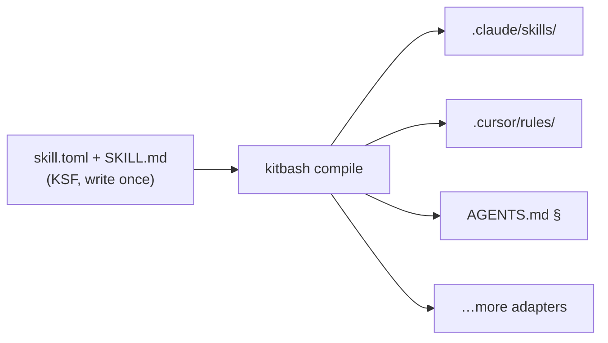

<p align="center">
  
</p>

# Kitbash

> **The open standard for portable AI agent skills.**
> Write a skill once. Run it in every coding agent you use.

```
JavaScript packages  →  npm
Containers           →  Docker
Lint rules           →  ESLint
Agent skills         →  Kitbash
```

**Status: pre-alpha. Spec draft v0.1. Nothing here is stable yet.**

## Thirty seconds

```
$ kitbash install gh:singhharsh1708/kitbash/examples/skills/prereview
installed prereview@0.1.0 — Review the working diff against this team's real standards…
  budget 1500 tokens · standing 60 · mode gate

$ kitbash compile
→ .claude/skills/prereview/SKILL.md
→ .cursor/rules/prereview.mdc
→ AGENTS.md
compiled 1 skill(s) for 3 agent target(s)
```

One skill, in every agent your team uses. **This works today, from source:**

```bash
git clone https://github.com/singhharsh1708/kitbash && cd kitbash/packages/cli
npm install && npm run build && npm link
cd ~/your-repo && kitbash init && kitbash doctor
```

Working now: `init` · `install` (gh:/`owner/repo`/file:) · `compile` (claude-code, cursor, AGENTS.md floor) · `doctor` · `list` · `remove` · budget enforcement · content-hash lockfile with drift detection · stale-output pruning · `--strict`. Evals, update diffs, and the rest land per the [roadmap](docs/roadmap.md).

**Interop:** a plain SKILL.md folder — the [skills.sh](https://www.skills.sh) / Claude Skills convention — installs directly (`kitbash install owner/repo`). It's KSF-minus-manifest: defaults get applied and it's flagged `unmanifested`, because nobody declared its budget or permissions. skills.sh distributes skills; Kitbash makes them engineering.

## The problem

Every assistant invented its own extension format — `.claude/skills/`, `.cursor/rules/*.mdc`, `copilot-instructions.md`, `AGENTS.md`, `.windsurfrules`, `.clinerules`, `CONVENTIONS.md`, `GEMINI.md`. A great skill written for one agent is dead weight for the rest of your team. And the skills people do share are unversioned, untested, unreviewable prompt files.

Prompts are code. Nobody is treating them that way. The full argument: [**MANIFESTO.md**](MANIFESTO.md).

## The fix

A skill is a directory in one open format ([KSF](spec/SPEC.md)), compiled to every agent's native format:

```
prereview/
  skill.toml        # budget, permissions, artifacts, dependencies
  SKILL.md          # the instructions
  scripts/          # optional deterministic helpers
  evals/            # tests — yes, tests for a skill
```

The format is the product. The compiler makes it real:



## Concepts

| Concept | One line | Depth |
|---|---|---|
| **Adapters** | Compile targets per agent; degradation is visible, never silent | [design](docs/design.md#the-compiler-and-adapters) |
| **Lockfile** | Content-hash pins; updates show instruction diffs like code review | [design](docs/design.md#resolution-and-trust) |
| **Budgets** | Every skill declares its token cost; the compiler enforces it | [spec](spec/SPEC.md) |
| **Permissions** | Auditable manifest of what a skill may touch | [spec](spec/SPEC.md) |
| **Artifacts** | Typed handoffs — stdin/stdout for agents; skills pipe into pipelines | [design](docs/design.md#artifacts-and-pipelines) |
| **Gates** | Skills with deterministic pass/fail — exit codes, not vibes | [design](docs/design.md#gates) |
| **Evals** | Three test tiers, from free lint to behavioral runs on fixture repos | [design](docs/design.md#evals) |
| **Lore** | Portable, version-controlled repo memory any agent can query | [design](docs/design.md#lore--repo-intelligence) |

## Flagship skills

`/prereview` reviews your diff against your team's *actual* standards · `/excavate` answers "why is this code like this?" with receipts · `/triage` classifies red CI runs · `/plan` turns issues into file-level plans · `/verify` proves the change works by driving it · `/migrate` runs checkpointed migration campaigns · `/onboard` generates living codebase tours.

Full specs and the rejection list: [docs/skills-catalog.md](docs/skills-catalog.md).

## Roadmap

v0.1 is a deliberately thin slice: **KSF + `compile` + three adapters + one skill**, done incredibly well. Registry, lore, and pipelines earn their place after the compiler proves itself. Full plan: [docs/roadmap.md](docs/roadmap.md).

## What Kitbash refuses to be

Not a prompt collection. Not an agent framework. Not a personality store. Not lock-in — compiled output is plain files in your repo; leave any time and everything keeps working.

## Contributing

The spec is a draft and this is the best time to shape it: [CONTRIBUTING.md](CONTRIBUTING.md). Landscape research behind the design: [docs/research.md](docs/research.md).

## License

Apache-2.0
