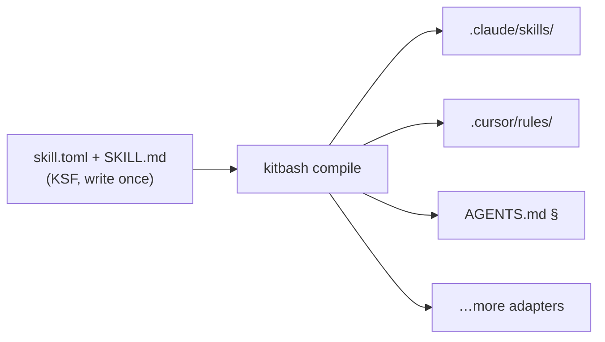

<p align="center">
  
</p>

# Kitbash

<p align="center">
  <a href="https://github.com/singhharsh1708/kitbash/stargazers"></a>
  <a href="https://github.com/singhharsh1708/kitbash/releases"></a>
  <a href="https://github.com/singhharsh1708/kitbash/actions/workflows/ci.yml"></a>
  
  <a href="LICENSE"></a>
</p>

> **The open standard for portable AI agent skills.**
> Write a skill once. Run it in every coding agent you use.

```
JavaScript packages  →  npm
Containers           →  Docker
Lint rules           →  ESLint
Agent skills         →  Kitbash
```

**Status: pre-alpha. Spec draft v0.1. Nothing here is stable yet.**

## Thirty seconds

<p align="center">
  
</p>

That's a **real session**: a third-party [skills.sh](https://www.skills.sh)-convention skill, installed and compiled into three agent formats. Note the last warning — Kitbash *measured* the skill during compile and reported that it silently costs **~5,044 tokens on every request** for agents that can't lazy-load. A converter translates formats; a compiler analyzes them. No other tool shows you that number.

**This works today, from source:**

```bash
git clone https://github.com/singhharsh1708/kitbash && cd kitbash/packages/cli
npm install && npm run build && npm link
cd ~/your-repo && kitbash init && kitbash doctor
```

Working now: `init` · `install` (gh:/`owner/repo`/file:) · `compile` to **7 targets** (Claude Code, Cursor, Copilot, Cline, Windsurf, GEMINI.md, AGENTS.md floor) · declared `/commands` compiled to native slash commands · `doctor` · `list` · `remove` · budget enforcement · content-hash lockfile with drift detection · stale-output pruning · `--strict`. Evals, update diffs, and the rest land per the [roadmap](docs/roadmap.md).

**Interop:** a plain SKILL.md folder — the [skills.sh](https://www.skills.sh) / Claude Skills convention — installs directly (`kitbash install owner/repo`). It's KSF-minus-manifest: defaults get applied and it's flagged `unmanifested`, because nobody declared its budget or permissions. skills.sh distributes skills; Kitbash makes them engineering.

## The problem

Every assistant invented its own extension format — `.claude/skills/`, `.cursor/rules/*.mdc`, `copilot-instructions.md`, `AGENTS.md`, `.windsurfrules`, `.clinerules`, `CONVENTIONS.md`, `GEMINI.md`. A great skill written for one agent is dead weight for the rest of your team. And the skills people do share are unversioned, untested, unreviewable prompt files.

This is not hypothetical. The most-starred skill on GitHub ships its one ruleset as **twenty hand-maintained copies** — `.cursor/rules/`, `.clinerules/`, `.kiro/steering/`, `.github/copilot-instructions.md`, six plugin manifests, and more — plus a CI script whose only job is checking the copies haven't drifted apart. Compare:

```
        the status quo                     kitbash
  ─────────────────────────        ───────────────────────
  .cursor/rules/skill.mdc           skill/
  .clinerules/skill.md                skill.toml
  .kiro/steering/skill.md             SKILL.md
  .github/copilot-instructions.md
  .windsurf/rules/skill.md          $ kitbash compile
  AGENTS.md, GEMINI.md, …           → 7 native outputs
  + a sync-check script             budgets enforced,
  × every update, forever           hashes pinned
```

Prompts are code. Nobody is treating them that way. The full argument: [**MANIFESTO.md**](MANIFESTO.md).

## The fix

A skill is a directory in one open format ([KSF](spec/SPEC.md)), compiled to every agent's native format:

```
prereview/
  skill.toml        # budget, permissions, artifacts, dependencies
  SKILL.md          # the instructions
  scripts/          # optional deterministic helpers
  evals/            # tests — yes, tests for a skill
```

The format is the product. The compiler makes it real:



## Concepts

| Concept | One line | Depth |
|---|---|---|
| **Adapters** | Compile targets per agent; degradation is visible, never silent | [design](docs/design.md#the-compiler-and-adapters) |
| **Lockfile** | Content-hash pins; updates show instruction diffs like code review | [design](docs/design.md#resolution-and-trust) |
| **Budgets** | Every skill declares its token cost; the compiler enforces it | [spec](spec/SPEC.md) |
| **Permissions** | Auditable manifest of what a skill may touch | [spec](spec/SPEC.md) |
| **Artifacts** | Typed handoffs — stdin/stdout for agents; skills pipe into pipelines | [design](docs/design.md#artifacts-and-pipelines) |
| **Gates** | Skills with deterministic pass/fail — exit codes, not vibes | [design](docs/design.md#gates) |
| **Evals** | Three test tiers, from free lint to behavioral runs on fixture repos | [design](docs/design.md#evals) |
| **Lore** | Portable, version-controlled repo memory any agent can query | [design](docs/design.md#lore--repo-intelligence) |

## Flagship skills

`/prereview` reviews your diff against your team's *actual* standards · `/excavate` answers "why is this code like this?" with receipts · `/triage` classifies red CI runs · `/plan` turns issues into file-level plans · `/verify` proves the change works by driving it · `/migrate` runs checkpointed migration campaigns · `/onboard` generates living codebase tours.

Full specs and the rejection list: [docs/skills-catalog.md](docs/skills-catalog.md).

## Roadmap

v0.1 is a deliberately thin slice: **KSF + `compile` + three adapters + one skill**, done incredibly well. Registry, lore, and pipelines earn their place after the compiler proves itself. Full plan: [docs/roadmap.md](docs/roadmap.md).

## FAQ

**Is this another prompt collection?**
No. It's a compiler, a package manager, and a format spec. The prompt collections are what get compiled.

**I already use skills.sh / Claude skills.**
Keep them — they install directly (`kitbash install owner/repo`). You gain seven targets, a lockfile, and a token-cost report; you lose nothing.

**What happens if I stop using Kitbash?**
Nothing. Compiled output is plain files in your repo. Delete `kitbash.toml` and everything keeps working exactly as it does today.

**Why would a skill author bother with the manifest?**
Because unmanifested skills compile with a warning label. A declared budget, permission set, and version is how your skill earns trust — and it's ~15 lines of TOML.

**Does my agent need a Kitbash runtime?**
No. There is no runtime. Your agent reads its own native format and never knows Kitbash exists.

## What Kitbash refuses to be

Not a prompt collection. Not an agent framework. Not a personality store. Not lock-in — compiled output is plain files in your repo; leave any time and everything keeps working.

## Contributing

The spec is a draft and this is the best time to shape it: [CONTRIBUTING.md](CONTRIBUTING.md). Landscape research behind the design: [docs/research.md](docs/research.md).

## License

Apache-2.0
