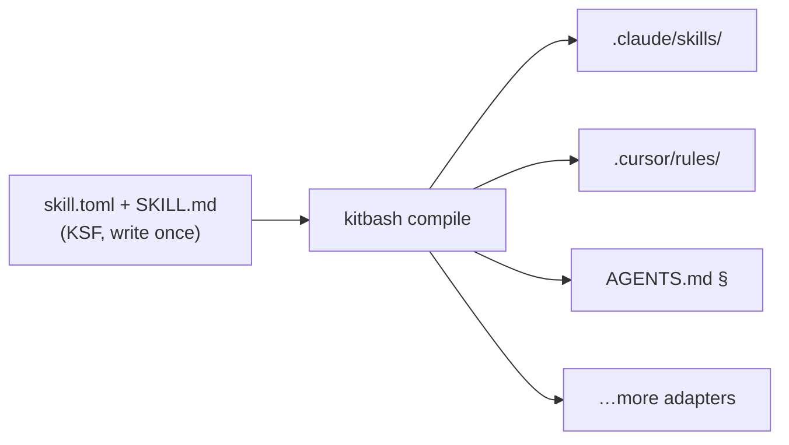

# Kitbash


Kitbash is a compiler for AI agent skills that measures what a skill costs your context window every session — before you install it.

You write the skill once in one open format ([KSF](spec/SPEC.md)) and compile it to the native format of ten coding agents — Claude Code, Cursor, Copilot, Zed, Cline, Devin, Gemini CLI, Aider, the vendor-neutral `.agents/skills/` path, and the `AGENTS.md` floor — plus an opt-in eleventh target, the [Agent Plugins](https://agent-plugins.org) v1.0 package format. While compiling, it measures each output's **standing** cost: the tokens the skill parks in context on every request, whether or not it ever gets used.

<p align="center">
  
</p>

```bash
npm install -g kitbash      # or: brew install singhharsh1708/tap/kitbash
kitbash init
kitbash preview gh:singhharsh1708/kitbash/examples/skills/prereview   # read it first — nothing is written
kitbash install gh:singhharsh1708/kitbash/examples/skills/prereview
kitbash compile
```

In a repo that already has `.claude/` and `.cursor/`, that last command prints:

```
→ .claude/skills/prereview/SKILL.md
→ .claude/commands/prereview.md
→ .cursor/rules/prereview.mdc
→ AGENTS.md
ℹ prereview → agentsmd: agentsmd is eager and cannot lazy-load, so this skill adds ~560 tokens standing every session (a lazy target pays 0; declared limit 60)
compiled 1 skill for 3 targets
  8 more target(s) available — add agents, zed, copilot, … under [project].targets in kitbash.toml, or create their agent dirs.
```

### The `ℹ` line is why this is a compiler, not a converter

The identical instructions cost ~40 standing tokens on a target that lazy-loads and ~560 on one that can't — a **14× per-session tax**, charged before the skill is ever invoked, on every agent that has no lazy mode. A separate unmanifested fixture measures 19 against 885, a 47× gap. One real third-party skill from the [skills.sh](https://www.skills.sh) convention carries ~5,044 tokens of instructions, which compile to ~5,101 standing tokens on an eager target.

Those numbers are measured, not asserted: the method and the full per-target table are in [docs/benchmarks/README.md](docs/benchmarks/README.md), and `npm run bench` inside `packages/cli` regenerates them. A converter would translate the format and stop. Kitbash reads the skill and tells you what it will cost you. I have not found another tool that surfaces that number.

Kitbash always compiles to the cheapest loading mode a target actually supports — nine of the eleven lazy-load; Aider's `CONVENTIONS.md` and the `AGENTS.md` floor cannot, and carry the whole body every session. (Aider does not read `CONVENTIONS.md` on its own — until you add `read: CONVENTIONS.md` to `.aider.conf.yml`, it costs nothing and does nothing, and `compile` says so.) `--strict` turns budget overruns and degradation warnings into build failures.

### Why not a sync script?

Because the copies are the problem. The usual fix for "my skill only works in my agent" is to maintain one hand-written file per agent, plus CI to check they haven't drifted apart:

```
        the status quo                     kitbash
  ─────────────────────────        ───────────────────────
  .cursor/rules/skill.mdc           skill/
  .clinerules/skill.md                skill.toml
  .kiro/steering/skill.md             SKILL.md
  .github/copilot-instructions.md
  .windsurf/rules/skill.md          $ kitbash compile
  AGENTS.md, GEMINI.md, …           → each detected target
  + a sync-check script             budgets enforced,
  × every update, forever           hashes pinned
```

A syncer multiplies your review surface; a compiler divides it. You review one skill instead of the generated copies — and installing a skill means letting someone else's instructions run with your agent's permissions, so that division is the whole point. Four safety lints block an install outright, a content-hash lockfile pins what you reviewed, `doctor` flags drift, `update` shows a full review diff before anything changes, and `[policy]` allowlists gate what may be installed at all — none of it bypassable with `--yes`. Details in [Trust & review](#trust--review).

Already have skills? A plain SKILL.md folder — the skills.sh / Claude Skills convention — installs directly with `kitbash install owner/repo`. It is basically KSF without the manifest, so Kitbash fills in defaults and marks it `unmanifested`, since nobody declared a budget or permissions for it.

Already carrying a hand-written `CLAUDE.md`, `.cursor/rules/`, `AGENTS.md`, and the rest of the copy-per-agent set? `kitbash import` reads them back into a single skill, measures what each one costs in standing context, and reports where the copies have drifted apart — so `kitbash compile` can regenerate them all from that one source. It touches nothing on disk until you remove the originals yourself.

**Status.** v0.24.1, on npm and Homebrew, zero runtime dependencies, Node 20+. The KSF core is frozen and additive-only within the major version ([RFC 0002](rfcs/0002-ksf-1.0-stabilization.md)). Everything around it is early and labeled as such: `init`, `import`, `install`, `remove`, `list`, `compile`, `doctor`, `update`, `diff`, `lint`, `preview`, `explain`, and `test` work today; `audit`, `gate`, `search`, `publish`, `lore`, and `run` exit `7` and are on the [roadmap](docs/roadmap.md). One first-party skill ships (`prereview`); six more are specified but not built. Adoption is single-digit stars — if the measurement above is what you want, you are early.

<p align="center">
  <a href="https://www.npmjs.com/package/kitbash"></a>
  <a href="https://github.com/singhharsh1708/kitbash/actions/workflows/ci.yml"></a>
  
  
  <a href="LICENSE"></a>
</p>

## Installation

Zero-dependency CLI. Needs Node 20+ (npm route) or Homebrew.

**Install**

```bash
npm install -g kitbash
# or
brew install singhharsh1708/tap/kitbash
```

Verify with `kitbash --version`.

**Update**

```bash
# npm
npm install -g kitbash@latest

# Homebrew
brew update && brew upgrade kitbash
```

**Uninstall**

```bash
# npm
npm uninstall -g kitbash

# Homebrew
brew uninstall kitbash
brew untap singhharsh1708/tap   # optional — removes the tap too
```

Uninstalling the CLI never touches your repo: compiled output is plain files you own. To clean a skill's generated files first, run `kitbash remove <skill> && kitbash compile` (prunes its outputs), then uninstall.

## Why this exists

Every assistant rolled its own extension format: `.claude/skills/`, `.cursor/rules/*.mdc`, `copilot-instructions.md`, `AGENTS.md`, `.windsurfrules`, `.clinerules`, `CONVENTIONS.md`, `GEMINI.md`. So a skill someone wrote for one agent does nothing for the rest of the team, and the skills people do share tend to be unversioned, untested prompt files nobody can really review.

This isn't a made-up problem: widely-used skills ship their single ruleset as a folder of hand-maintained per-agent copies, with a CI script whose only job is checking the copies haven't drifted apart. That is the shape [the diagram above](#why-not-a-sync-script) contrasts.

Prompts are code, and almost nobody treats them that way. The longer version of this argument is in [MANIFESTO.md](MANIFESTO.md).

## How it works

A skill is just a directory in one open format ([KSF](spec/SPEC.md)) that compiles to each agent's native format:

```
prereview/
  skill.toml        # budget, permissions, artifacts, dependencies
  SKILL.md          # the instructions
  scripts/          # optional deterministic helpers
  evals/            # tests — yes, tests for a skill
```

The format is the whole point, and the compiler is what makes it useful:


```mermaid
flowchart LR
    S["skill.toml + SKILL.md<br/>(KSF, write once)"] --> C["kitbash compile"]
    C --> A[".claude/skills/"]
    C --> B[".cursor/rules/"]
    C --> D["AGENTS.md §"]
    C --> E["…more adapters"]
```

## Trust & review

Installing a skill means letting someone else's instructions run with your agent's permissions. Kitbash treats that as the core problem, not an afterthought:

- **Readable before install** — `kitbash preview gh:owner/repo` (also `lint`, `explain`) fetches and renders a skill *without installing it*: exact compiled output per agent, token costs, permissions, injection heuristics.
- **Review at install** — `kitbash install` shows what the skill declares (permissions, network/write access, budget, lint warnings) and asks before writing anything. `--yes` skips the prompt in scripts; CI is non-interactive by default.
- **Safety lints block install** — four hard gates, non-bypassable by `--yes`, enforced with or without a `[policy]` file:

  | Lint | Refuses |
  |---|---|
  | `visible-text` | Instructions a reviewer cannot see — zero-width characters, bidi overrides, the Unicode Tags block, NUL bytes in text |
  | `dynamic-context` | Command substitution that executes when the file loads, before the model reads anything |
  | `remote-exec` | Download-and-execute payloads — `curl … \| sh` and its family, buried in prose or a code fence |
  | `secrets` | A live credential shipped inside the skill — API key, database password, private-key block |

  The scan covers every non-binary file in the skill, not just `SKILL.md` — a payload in `scripts/setup.sh` or a sibling file is caught, and a symlink is flagged. A placeholder guard keeps a skill that only *documents* a key format from being blocked. These are heuristics over text plus hard gates on the result, not proof: `c=curl; $c url | sh` defeats a regex on prose. They raise the cost of the copy-paste attack classes at the one chokepoint where a skill fans out to nine files. Read the skill.

  In 0.15.0 a self-audit of these gates found four ways past them — a broken `{{template}}` silently disabled all four body lints, one NUL byte exempted a whole file, `[__proto__.policy]` in a manifest switched off the `remote-exec` gate before the policy loader ran, and `..` escaped an `allow_sources` allowlist. Each is fixed with a regression test that reproduces the original exploit ([CHANGELOG](CHANGELOG.md), tests `A1`–`A10` in [`packages/cli/scripts/test.mjs`](packages/cli/scripts/test.mjs)).
- **Pinned by content** — `kitbash.lock` records a content hash per skill; `doctor` flags any drift between what you reviewed and what's on disk.
- **Org allowlists** — a `[policy]` table in `kitbash.toml` restricts which sources may be installed and what installed skills may declare. Policy is a hard gate: `--yes` doesn't bypass it, and `doctor` rechecks it against everything already installed.

```toml
[policy]
allow_sources = ["gh:your-org/*"]  # only skills from your org
deny_network = true                # refuse skills declaring network access
deny_write = true                  # refuse skills declaring write access
max_budget = 6000                  # cap per-skill context budget
# deny_mcp = true                  # refuse skills declaring any MCP server
# allow_mcp_servers = ["https://mcp.your-org.com/*"]  # globs; matched against a server's command or url
# max_mcp_tools = 100              # cap declared MCP tools across all skills
# deny_remote_exec = false         # opt out of the curl|sh body lint (default: on)
```

## MCP servers

A skill can declare the MCP servers it needs. `compile` writes the native config for every target that has one:

```toml
[mcp.servers.deploy-tools]
transport = "stdio"                              # stdio | streamable-http | sse
command = "npx"                                  # a single executable, never a shell string
args = ["-y", "@acme/deploy-mcp@2.4.1"]          # pin the version — unpinned fails the gate
tools = ["plan_diff", "list_environments"]       # required: deny-by-default allowlist

[mcp.servers.deploy-tools.env]
DEPLOY_TOKEN = "${ACME_DEPLOY_TOKEN}"            # a reference; a literal credential fails the gate
```

Six targets have a project-scoped MCP surface, and Kitbash writes all six: `claude-code` → `.mcp.json`, `copilot` → `.github/mcp.json`, `cursor` → `.cursor/mcp.json`, `agent-plugins` → `<plugin-root>/mcp.json`, plus `gemini` → `.gemini/settings.json` and `zed` → `.zed/settings.json`, which are **merged** rather than overwritten.

Nothing is passed through verbatim, because the dialects genuinely disagree: the HTTP transport is `http` in Claude Code, Copilot and Gemini but `streamable-http` in Agent Plugins; timeouts are milliseconds everywhere except Zed, which uses seconds and silently clamps at 600; Zed wants no `type` key while Gemini needs one, since a bare `url` there defaults to Streamable HTTP. Every emitter translates.

Merging into a settings file is a destructive-write class — those files hold configuration with nothing to do with skills — so only the server key is touched, servers you added by hand survive, and a file Kitbash cannot parse (or one containing comments, which `JSON.parse` cannot round-trip) is **refused, never overwritten**.

The remaining five targets get a warning naming the specific reason — `no-mcp-surface` (aider and AGENTS.md have no configuration mechanism), `no-project-scope` (Cline and Windsurf are user-global only), `unconfirmed-path` (the `.agents` convention) — and **no file**. A config the client never reads would look configured and do nothing, which is the failure mode this project exists to prevent.

### What it costs you

`compile` and `doctor` report the tool budget: `MCP tool budget: 8 tool(s) across 2 server(s); cap 100`. Every tool in a declared allowlist is a tool definition the agent carries for the whole session, so the allowlist is an exact floor on the cost — and `max_mcp_tools` in `[policy]` caps it, warning on breach and failing `--strict`. The default ceiling is 100, the one limit any client documents (Windsurf, past which tools are dropped).

The *real* token cost is reported as unmeasured, and stays that way on purpose. It is the JSON schema of every tool a server exposes, which is only knowable by asking the server — and asking a stdio server means executing it, which is precisely what the install gate exists to prevent. A floor Kitbash can prove beats an estimate it cannot.

A declared MCP server is third-party code that will run with your agent's permissions, so its lints are non-bypassable, like the four safety lints: shell strings, unpinned versions, literal credentials, plain-`http` URLs off loopback, and a missing `tools` allowlist all block install, `--yes` included. Secrets may only appear as `${VAR}`; where a format defines no credential reference and expands no variables, the server is omitted with a warning rather than emitted broken.

## In CI

Everything above is only as good as the last time someone ran it locally. The action makes it a check on the pull request:

```yaml
- uses: singhharsh1708/kitbash@v0.18.0
  with:
    strict: true          # warnings fail the build too
    sarif: true           # default — writes kitbash.sarif

- uses: github/codeql-action/upload-sarif@v3
  with:
    sarif_file: kitbash.sarif
```

Three checks in one step:

| Check | Fails when |
|---|---|
| **Trust** | A skill trips a hard safety lint — `remote-exec`, `visible-text`, `dynamic-context`, `secrets` |
| **Cost** | A skill exceeds the token budget or standing limit it declares |
| **Drift** | `kitbash compile` changes the working tree — the committed output no longer matches its source |

Findings upload as [SARIF 2.1.0](https://sarifweb.azurewebsites.net), so they appear in the Security tab and inline on the PR: hard lints as errors, heuristics and cost overruns as warnings. `kitbash lint --sarif <file>` produces the same report locally.

Drift is the check worth having even if you trust every skill you install. A skill compiles to eleven targets; nothing stops someone editing a generated `.cursor/rules/*.mdc` by hand, or changing the source and forgetting to recompile. Then each agent reads something slightly different and no one finds out. Recompiling in CI and failing on any diff makes that impossible to merge.

## Concepts

| Concept | One line | Depth |
|---|---|---|
| **Adapters** | Compile targets per agent; degradation is visible, never silent | [design](docs/design.md#the-compiler-and-adapters) |
| **Lockfile** | Content-hash pins; updates show instruction diffs like code review | [design](docs/design.md#resolution-and-trust) |
| **Budgets** | Every skill declares its token cost; the compiler enforces it | [spec](spec/SPEC.md) |
| **Permissions** | Auditable manifest of what a skill may touch | [spec](spec/SPEC.md) |
| **Artifacts** | Typed handoffs — stdin/stdout for agents; skills pipe into pipelines | [design](docs/design.md#artifacts-and-pipelines) |
| **Gates** | Skills with deterministic pass/fail — exit codes, not vibes | [design](docs/design.md#gates) |
| **Evals** | Three test tiers, from free lint to behavioral runs on fixture repos | [design](docs/design.md#evals) |
| **Lore** | Portable, version-controlled repo memory any agent can query | [design](docs/design.md#lore--repo-intelligence) |

## Flagship skills

One skill ships today: `/prereview`, which reviews your diff against your team's actual standards. Six more are designed in detail but not yet built — `/excavate` answers "why is this code like this?" and shows its work, `/triage` sorts out red CI runs, `/plan` turns issues into file-level plans, `/verify` proves a change works by actually driving it, `/migrate` runs checkpointed migration campaigns, and `/onboard` writes living codebase tours. They're on the [roadmap](docs/roadmap.md).

Full specs, plus the list of things we decided not to build, are in [docs/skills-catalog.md](docs/skills-catalog.md).

## Roadmap

v0.1 is intentionally a thin slice: KSF, `compile`, three adapters, and one skill, all done well. Registry, lore, and pipelines come once the compiler has earned it. The full plan is in [docs/roadmap.md](docs/roadmap.md).

## FAQ

**Is this just another prompt collection?**
No. It's a compiler, a package manager, and a format spec. Prompt collections are the thing that gets compiled.

**I already use skills.sh / Claude skills.**
Keep them. They install directly with `kitbash install owner/repo`. You pick up eleven targets, a lockfile, and a token-cost report, and you don't give anything up.

**What if I stop using Kitbash?**
Nothing breaks. The compiled output is plain files in your repo. Delete `kitbash.toml` and everything keeps working the way it does now.

**Why would a skill author bother writing the manifest?**
Because without it, the skill compiles with a warning label. A declared budget, permission set, and version is how a skill earns trust, and it's about 15 lines of TOML.

**Does my agent need a Kitbash runtime?**
No, there's no runtime. Your agent just reads its own native format and never knows Kitbash was involved.

## What Kitbash isn't

It's not a prompt collection, not an agent framework, and not a personality store. And it's not lock-in — the compiled output is plain files in your repo, so you can walk away any time and everything keeps working.

## Contributing

The core spec is stable, but the provisional fields and the whole ecosystem around it are wide open — now is a good time to help shape them: [CONTRIBUTING.md](CONTRIBUTING.md). Spec-level changes go through [RFCs](rfcs/README.md). The research behind the design is in [docs/research.md](docs/research.md).

## Sponsor

If Kitbash saves you time, or your team leans on it, consider [sponsoring the work](https://github.com/sponsors/singhharsh1708). Sponsorship goes toward turning this into a real standard — the spec, the adapters, the evals.

## License

Apache-2.0
